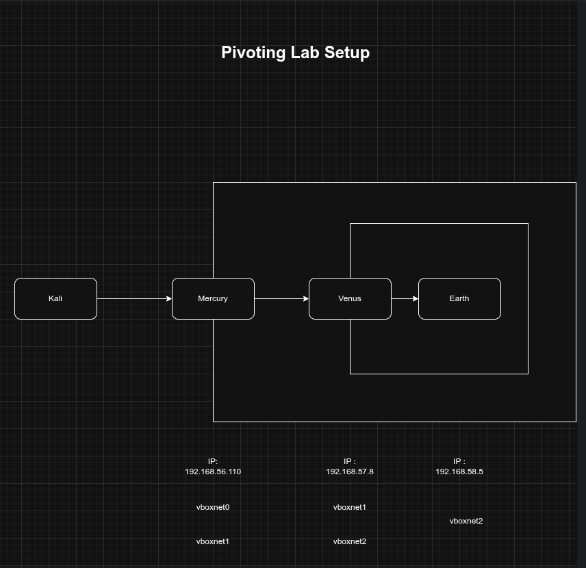

# Pivoting-with-Ligolo-ng

This repo documents a self-built network pivoting lab simulating a segmented 
internal network, using [VulnHub's](https://vulnhub.com/?q=planets) "Planets" machines (Mercury, Venus, Earth) 
and Ligolo-ng for tunneling.

## Network Topology
- Kali can only reach **Mercury** directly
- **Mercury** can reach **Venus**, but not Earth
- **Venus** can reach **Earth**
- Goal: compromise Mercury → pivot to Venus → pivot to Earth

Host-only VirtualBox adapters (vboxnet0, vboxnet1, vboxnet2) were used to 
enforce this segmentation, replicating the kind of network isolation you'd 
encounter in a real internal penetration test.

## What's covered
- VirtualBox host-only network interface setup
- Importing and configuring the VulnHub VMs
- Exploitation of each machine in the chain
- Setting up Ligolo-ng tunnels to pivot between segments
- Reasoning behind each pivoting decision, not just commands run

## Why I built this
Most beginner labs and CTF boxes focus on single-target exploitation. I wanted 
hands-on practice with multi-hop pivoting specifically, since that's a skill 
gap between solving isolated boxes and understanding how attackers move through 
real segmented networks.
